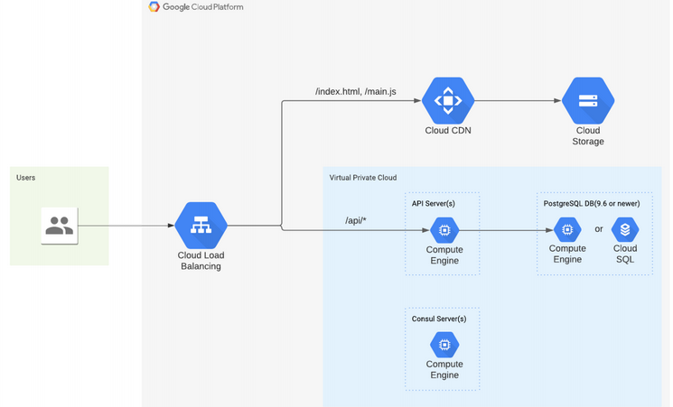

## Toggl Track SRE Home Assignment
 This project is to create an 
  automated way to
provisioning and configure the following in Google Cloud Platform using Terraform:

## components

### Consul Server

The solution is a single Hashicorp Consul, running on Compute Engine for service discovery inside a VPC(Virtual Private Cloud).

### PostgreSQL Database
The solution is a single PostgreSQL instance running on 9.6. in Cloud SQL inside a VPC(Virtual Private Cloud).

### API Server
The solution is an API Server running on Compute Engine with PostgreSQL connection in an HTTP port (8000 in this case) inside a VPC(Virtual Private Cloud) and registering it in consul and adding health check.

### Cloud Storage
The solution is a publicly available(read only) bucket to serve the static content.
### Routing
The solution is a Cloud Load Balancer that routes all ‘/api/*’ traffic to the API Server
and static content to the Cloud Storage Bucket with Cloud CDN enabled.

## Procedure

 - First a VPC with subnets and firewall with tcp protocol enabled is created.
 - A Google compute engine with debian-9 linux distribution is created inside the VPC for the consul server with ssh keys enabled.
 - Another Google compute engine with debian-9 linux distribution is created inside the VPC for the API server with ssh keys enabled.
 - A single PostgreSQL instance running on 9.6. in Cloud SQL inside the VPC is created with "username" and "password" for the database.
 - Now, the API server is running with the source code which was cloned with git from a source repository and Postgresql connection in port 8000.
 - The API Service is now registered in consul and added health check using the following command in json format`{"service": {"name": "api", "port":80, "check": {"args": ["curl", "localhost"], "interval": "10s"}}}` in a json file in the `/consu.d` directory in the compute engine in which the consul is installed and running .
 - A google cloud storage bucket is created to serve the static content and served.
 - A Cloud Load Balancer that routes all `/api/*` traffic to the API Server and static content to the Cloud Storage Bucket with Cloud CDN and Cloud DNS enabled.
